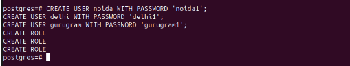

 <u> <h1 style="font-size: 50px;"> Postgres Tutorial</h1> </u> 

## Table of contents
**1. Task requirement**

**2. Environment details**

**3. System configuration**

**4. Definition of tools**

## 1. Task requirement: Podman.PostgresSQL

## 2. Environment details: 
- Os:- Ubuntu 22.04.3 LTS
- Podman- 3.4.4
- Psql (PostgreSQL) 14.9

## 3. System configuration:
- CPU - 4
- Storage -16 GB

## 4. Definition of tools:

- Podman is an open-source container management tool used to create, run, and manage containers on Linux systems.

- PostgreSQL ek open-source relational database management system (RDBMS) 
hai jo data storage aur management ke liye istemal hota hai.

## 1. Create a postgres instance of postgres 14 with volume mounted.

>sudo apt install -y podman

>podman version

>sudo mkdir -p /home/prince/postgres-data

>podman run --name postgres -d -p 5432:5432 -e POSTGRES_PASSWORD=mysecretpassword -v postgres-data:/var/lib/postgresql/data postgres:14

- podman run: Ye command ek container ko create aur run karne ke liye use hoti hai.
- -d: Ye option container ko background mode me run karne ke liye use hota hai, matlab container run hoga aur aapka terminal available rahega.
- --name my-postgres: Is option se aap apne container ko "my-postgres" naam se identify kar sakte hain.
- -e POSTGRES_PASSWORD=mysecretpassword: Is option se aap environment variable set kar rahe hain, jiska naam "POSTGRES_PASSWORD" hai aur value "mysecretpassword" hai. Ye password PostgreSQL database access ke liye use hoga.
- -v /mydata:/var/lib/postgresql/data: Is option se aap ek volume mount kar rahe hain. /mydata host system ke path ko /var/lib/postgresql/data container ke path se map karega. Isse aap apne database data ko host system me store kar sakte hain, taki wo persist kare, aur aap container ko delete karne ke baad bhi data safe rahe.
- 'postgres:14: Ye image name hai, jise aap container se use kar rahe hain. "postgres:14" PostgreSQL ke version 14 ke official Docker image ko represent karta hai. Isse container PostgreSQL database server ke sath run karega.

## Verify that the PostgreSQL container is running:

>podman ps

## 2.create users,databases,tables,extensions on the same.

>podman exec -it postgres psql -U postgres

## (a) Create Users

>CREATE USER noida WITH PASSWORD 'noida1';
CREATE USER delhi WITH PASSWORD 'delhi1';
CREATE USER gurugram WITH PASSWORD 'gurugram1';
CREATE ROLE
CREATE ROLE
CREATE ROLE

## (b) Databases

>postgres=# CREATE DATABASE my_database;

## (c) Tables

>postgres=# \l (List of databases) 

>postgres=# \c (connected to database)

>CREATE TABLE my_table (
  id SERIAL NOT NULL PRIMARY KEY,
  name VARCHAR(255) NOT NULL
);

- CREATE TABLE: This keyword tells the database to create a new table.
  
- my_table: This is the name of the table that is being created.
- ( id SERIAL NOT NULL PRIMARY KEY, name VARCHAR(255) NOT NULL ): This is the definition of the table, which includes the names and data types of the columns in the table.
### Here is a more detailed explanation of each part of the statement:
- id SERIAL NOT NULL PRIMARY KEY: This column will store the unique identifier for each row in the table. The SERIAL data type means that the database will automatically generate a unique integer value for each new row that is inserted into the table. The NOT NULL constraint means that this column cannot be empty. The PRIMARY KEY constraint means that this column uniquely identifies each row in the table.

- name VARCHAR(255) NOT NULL: This column will store the name of each row in the table. The VARCHAR(255) data type means that this column can store up to 255 characters of text. The NOT NULL constraint means that this column cannot be empty.

## (C)  extensions

>CREATE EXTENSION pg_trgm;

>CREATE EXTENSION

  **EXTENSION**  Ye SQL statement PostgreSQL database mein ek extension ko create karne ya activate karne ke liye istemal hota hai. Extension ek prakar ke additional modules ya functions hote hain jo PostgreSQL database functionality ko extend karte hain.

**pg_trgm**  Ye extension PostgreSQL mein full-text search aur trigram similarity capabilities provide karta hai.
Full-text search ka use karke, aap apne data mein text ko search kar sakte hain. Trigram similarity ka use karke, aap apne data mein text ke similarity ko calculate kar sakte hain.
In capabilities ka use karne ke kai liye hai. For example, aap ine capabilities ka use karke ek website mein contents ko search kar sakte hain, ek database mein data ko search kar sakte hain, ya ek document collection mein documents ko search kar sakte hain.

### 3.Perform crud operations.

**CRUD (Create, Read, Update, Delete)**

### (a)Create 

- id: A serial column that is the primary key of the table. This means that each row in the table will have a unique id value.
- name: A VARCHAR column that stores the name of the hospital.
- address: A VARCHAR column that stores the address of the hospital.
- phone: A VARCHAR column that stores the phone number of the hospital.
- NOT NULL: constraint on all of the columns means that each column must have a value. No rows will be inserted into the table if any of the columns are empty.
- VARCHAR : is a variable-length string data type in SQL. It means that it can store strings of any length, up to the maximum length specified when the column is created. It is a good choice for storing strings of variable length, such as names, addresses, and phone numbers.

## (b) Read

>my_database=# select * from hospitals;

## (C ) Update

>UPDATE laptops SET price = '2,49,900' WHERE id = 1;

## (D) Delete

>dall=# DELETE FROM laptops WHERE id = 1;

## 4. Create three users with a password.

>CREATE ROLE user 1 WITH LOGIN PASSWORD 'password1';
CREATE ROLE user 2 WITH LOGIN PASSWORD 'password2';
CREATE ROLE user 3WITH LOGIN PASSWORD 'password3';

>\du (User show)

## 5. Grant select permission for user1,select,insert,delete for user2 and all for user3.

>GRANT ALL PRIVILEGES ON ALL TABLES IN SCHEMA public TO user3;

## 6. Take the dump of this table and insert it in the test database.

>pg_dump -U your_superuser -d your_source_database -t your_table_name -f dump_file_name.sql

>DUMP file restore 

## 7. Create a replica of the same.

>podman network create --subnet=172.18.0.0/24 postnetwork**

## (a) Make Directory

>mkdir -p /home/praveen/data/psql/master mkdir -p /home/praveen/data/psql/slave mkdir -p /home/praveen/data/psql/repl 
Make Directorypodman unshare chown -R 999:999 /home/praveen/data/psql/master podman unshare chown -R 999:999 /home/parveen/data/psql/slave podman unshare chown -R 999:999 /home/praveen/data/psql/repl

## (1) (a) Master container

>podman run -d \
--network postnetwork --ip 172.18.0.101 -p 5432:5432 \
--name master -h master \
-e "POSTGRES_DB=postgres" \
-e "POSTGRES_USER=postgres" \
-e "POSTGRES_PASSWORD=redhat" \
-v /home/praveen/data/psql/master:/var/lib/postgresql/data \
docker.io/postgres

## 2 (a) Slave container

>podman run -d \
--network postnetwork --ip 172.18.0.102 -p 5433:5432 \
--name slave -h slave \
-e "POSTGRES_DB=postgres" \
-e "POSTGRES_USER=postgres" \
-e "POSTGRES_PASSWORD=redhat" \
-v /home/praveen/data/psql/slave:/var/lib/postgresql/data \
-v /home/praveen/data/psql/repl:/var/lib/postgresql/repl \
docker.io/postgres

**1.(a)**
**(MASTER SARVAR)**
>podman exec -it master bash
 psql -U postgres

**(b)**
>postgres=# CREATE ROLE repuser WITH LOGIN REPLICATION CONNECTION LIMIT 5 PASSWORD 'redhat';

>\du

>cd /home/ppraveen/data/psql/master

**(d)**

>vim postgresql.conf
archive_mode = on				# Enable Archive Mode
archive_command = '/bin/date'	# Set archiving behavior
 #The sum of the number of concurrent connections from the slave to the host
 max_wal_senders = 10			
 #Specifies that if the backup server needs to obtain log segment files for stream replication, pg_ The minimum size of past log file segments that can be retained in the wal directory	
 wal_keep_size = 16		
 #Specify a list of backup servers that support synchronous replication
 synchronous_standby_names = '*'

**2. (a) SLAVE  container**

>podman exec -it -u postgres slave /bin/bash

>postgres@slave:/$ pg_basebackup -R -D /var/lib/postgresql/repl -Fp -Xs -v -P -h 172.18.0.101 -p 5432 -U repuser

## 8. Create a new schema 

>create schema myschema;

>\dn (show schema)

>create table myschema.company

>select * from myschema.company;

## 9. Create extensions in the new schema.

>\dx (extensions show)

**Plpgsql:-**  ek PostgreSQL extension hai, jiska matlab "Procedural Language/PostgreSQL" hota hai. Ye extension PostgreSQL mein stored procedures, functions, aur triggers likhne ke liye ek procedural programming language provide karta hai. plpgsql PostgreSQL database mein built-in tariko se PostgreSQL ke features aur data par programmatic control dene me madad karta hai.

### 10. Create another table and explain about the different joins.

**Different types of joins:**

- Inner join: Returns all rows from both tables where the join condition is met.

>CREATE TABLE best_android_phones

>INSERT INTO best_android_phones 

>\dt

>select * from best_android_phones;

>CREATE TABLE ratings

>INSERT INTO ratings

>INNER JOIN 

### 11. Understanding the table structure,finding database size, table size etc.

**(a) Table structure**

>(\d table name)

- This will list the name, data type, and other information about each column in the table.

**(b) finding database size**

**(c) table size**

## 12. Create a new table with the data and structure of the 

- old table.

**(a)**
>SQL
CREATE TABLE new_students AS (
 SELECT id, name, email FROM students
);

>\dt  (table show )

>select * from students; ( table show )

**(b)**

>CREATE TABLE new_students AS (
  SELECT * FROM students
);

>COPY new_students FROM students;

>SELECT * FROM new_students;

>\dt

## 13. What are indexes,sequences,triggers,union,locks,materialised views,functions etc. with examples w.r.t your setup .

**(a) indexes**

- indexes ek aise data structure hain jo PostgreSQL ko data ko quickly find karne mein madad karte hain। ve ek ya adhik columns per create hote hain, aur ve un columns ke values ko sorted order mein store karte hain। yah PostgreSQL ko ek table mein rows ko quickly find karne ki anumati deta hai jo ek diye gaye value in range of values ke sath match karti hain।

>CREATE INDEX idx_contractor_name ON contractor (contractor_name);

> SELECT *
FROM contractor
WHERE contractor_name = 'praveen';

**(b) sequence**

- sequence ek aisi object hai jo unique numbers generate karti hai। unka upyog kabhi-kabhi tables ke liye primary key values generate karne ke liye kiya jata hai।

**trigger**
- trigger ek aise procedure hain jo automatically execute hote hain jab table per kuchh events hoti hain। ek example yah hai ki aap ek trigger create kar sakte hain jo ek naye row ko students table mein insert kiye jaane ke bad execute kiya jaaye। yah trigger fir school principal ko email notification send kar sakta hai।

**Trigger name is ‘ Backup’ table whenever data is deleted from ‘main’ table.**

>create table linux
(
id int,
salary int);

>insert into linux values(1,10000);
insert into linux values(2,20000);

>Create  table backup 
(   id  int,
Salary int);

>CREATE OR REPLACE FUNCTION backup_function() RETURNS TRIGGER AS
BEGIN 
INSERT INTO backup VALUES (OLD.id, OLD.salary);
RETURN OLD;
END;
$$ LANGUAGE plpgsql;
CREATE TRIGGER t1
BEFORE DELETE ON linux
FOR EACH ROW
EXECUTE FUNCTION backup_function();

>delete from linux where id=1;

- After show backup table

**union**

- union operator ka upyog 2 ya adhik SELECT statements ki results ko combine karne ke liye kiya jata hai। union operation ki results first column ke ascending order mein sort ki jaati hai

>SELECT * FROM new_students UNION SELECT * FROM person UNION SELECT * FROM students;

>ALTER TABLE students ADD COLUMN major VARCHAR(255);

**lock**

- lock ka upyog dusron ko aapke data ko modify karne se rokne ke liye kiya jata hai jo aap abhi modify kar rahe hain। yah data ki integrity ko ensure karne mein madad karta hai।

>collage=# select *from students;

>BEGIN;
LOCK TABLE students IN SHARE MODE;
-- Access the students table
COMMIT;
BEGIN
LOCK TABLE
COMMIT

**materialised view**

- materialised view table ke data ke precomputed views hain। unka upyog frequently executed queries ki performance improve karne ke liye kiya jata hai।

>CREATE MATERIALIZED VIEW new_students_materialized AS
SELECT *

>collage=# SELECT name, father_name
FROM new_students_materialized_view;

**function**

- function user-defined procedures hain jin ka upyog common tasks ko perform karne ke liye kiya ja sakta hai, jaise data ko format karna, values calculate karna, aur data ko validate karna।

- function to calculate the age:

>CREATE OR REPLACE FUNCTION calculate_age(date_of_birth date) RETURNS integer AS $$
DECLARE
age_in_years integer;
BEGIN
SELECT EXTRACT(YEAR FROM age(date_of_birth)) INTO age_in_years;
RETURN age_in_years;
END;LANGUAGE plpgsql;

- Now, you can use the calculate_age function to calculate the age of a person based on their birthdate. For example:

