<center> <u> <h1 style="font-size: 50px;"> Postgres Task</h1> </u> </center>

## 1. Task requirement: Podman.PostgresSQL

## 2. Environment details: 
- Os:- Ubuntu 22.04.3 LTS
- Podman- 3.4.4
- Psql (PostgreSQL) 14.9

## 3. System configuration:
- CPU - 4
- Storage -16 GB


## 4. Definition of tools:

- Podman is an open-source container management tool used to create, run, and manage containers on Linux systems.

- PostgreSQL ek open-source relational database management system (RDBMS) 
hai jo data storage aur management ke liye istemal hota hai.


## 1. Create a postgres instance of postgres 14 with volume mounted.

```bash
sudo apt install -y podman
```
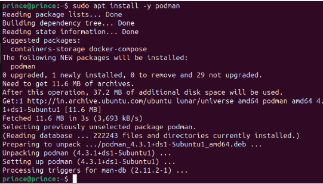

>podman version

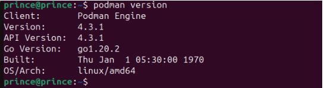

>sudo mkdir -p /home/prince/postgres-data


>podman run --name postgres -d -p 5432:5432 -e POSTGRES_PASSWORD=mysecretpassword -v postgres-data:/var/lib/postgresql/data postgres:14

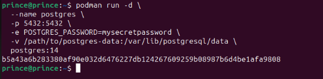


- podman run: Ye command ek container ko create aur run karne ke liye use hoti hai.
- -d: Ye option container ko background mode me run karne ke liye use hota hai, matlab container run hoga aur aapka terminal available rahega.
- --name my-postgres: Is option se aap apne container ko "my-postgres" naam se identify kar sakte hain.
- -e POSTGRES_PASSWORD=mysecretpassword: Is option se aap environment variable set kar rahe hain, jiska naam "POSTGRES_PASSWORD" hai aur value "mysecretpassword" hai. Ye password PostgreSQL database access ke liye use hoga.
- -v /mydata:/var/lib/postgresql/data: Is option se aap ek volume mount kar rahe hain. /mydata host system ke path ko /var/lib/postgresql/data container ke path se map karega. Isse aap apne database data ko host system me store kar sakte hain, taki wo persist kare, aur aap container ko delete karne ke baad bhi data safe rahe.
- 'postgres:14: Ye image name hai, jise aap container se use kar rahe hain. "postgres:14" PostgreSQL ke version 14 ke official Docker image ko represent karta hai. Isse container PostgreSQL database server ke sath run karega.

## Verify that the PostgreSQL container is running:

>podman ps


## 2.create users,databases,tables,extensions on the same.

>podman exec -it postgres psql -U postgres


## (a) Create Users

>CREATE USER noida WITH PASSWORD 'noida1';
CREATE USER delhi WITH PASSWORD 'delhi1';
CREATE USER gurugram WITH PASSWORD 'gurugram1';
CREATE ROLE
CREATE ROLE
CREATE ROLE


## (b) Databases

>postgres=# CREATE DATABASE my_database;


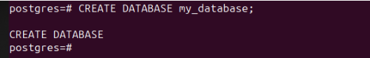


## (c) Tables

>postgres=# \l (List of databases) 

>postgres=# \c (connected to database)


>CREATE TABLE my_table (
  id SERIAL NOT NULL PRIMARY KEY,
  name VARCHAR(255) NOT NULL
);


- CREATE TABLE: This keyword tells the database to create a new table.
  
- my_table: This is the name of the table that is being created.
- ( id SERIAL NOT NULL PRIMARY KEY, name VARCHAR(255) NOT NULL ): This is the definition of the table, which includes the names and data types of the columns in the table.
### Here is a more detailed explanation of each part of the statement:
- id SERIAL NOT NULL PRIMARY KEY: This column will store the unique identifier for each row in the table. The SERIAL data type means that the database will automatically generate a unique integer value for each new row that is inserted into the table. The NOT NULL constraint means that this column cannot be empty. The PRIMARY KEY constraint means that this column uniquely identifies each row in the table.
max_wal_sendersmax_wal_senders
- name VARCHAR(255) NOT NULL: This column will store the name of each row in the table. The VARCHAR(255) data type means that this column can store up to 255 characters of text. The NOT NULL constraint means that this column cannot be empty.


## (C)  extensions

>CREATE EXTENSION pg_trgm;

>CREATE EXTENSION

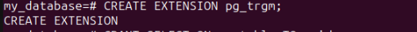

  **EXTENSION**  Ye SQL statement PostgreSQL database mein ek extension ko create karne ya activate karne ke liye istemal hota hai. Extension ek prakar ke additional modules ya functions hote hain jo PostgreSQL database functionality ko extend karte hain.

**pg_trgm**  Ye extension PostgreSQL mein full-text search aur trigram similarity capabilities provide karta hai.
Full-text search ka use karke, aap apne data mein text ko search kar sakte hain. Trigram similarity ka use karke, aap apne data mein text ke similarity ko calculate kar sakte hain.
In capabilities ka use karne ke kai liye hai. For example, aap ine capabilities ka use karke ek website mein contents ko search kar sakte hain, ek database mein data ko search kar sakte hain, ya ek document collection mein documents ko search kar sakte hain.


### 3.Perform crud operations.

**CRUD (Create, Read, Update, Delete)**

### (a)Create 


- id: A serial column that is the primary key of the table. This means that each row in the table will have a unique id value.
- name: A VARCHAR column that stores the name of the hospital.
- address: A VARCHAR column that stores the address of the hospital.
- phone: A VARCHAR column that stores the phone number of the hospital.
- NOT NULL: constraint on all of the columns means that each column must have a value. No rows will be inserted into the table if any of the columns are empty.
- VARCHAR : is a variable-length string data type in SQL. It means that it can store strings of any length, up to the maximum length specified when the column is created. It is a good choice for storing strings of variable length, such as names, addresses, and phone numbers.


## (b) Read

>my_database=# select * from hospitals;


## (C ) Update


>UPDATE laptops SET price = '2,49,900' WHERE id = 1;


## (D) Delete

>dall=# DELETE FROM laptops WHERE id = 1;

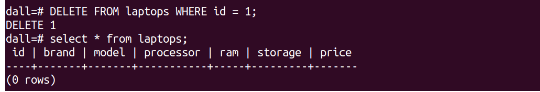


## 4. Create three users with a password.

>CREATE ROLE user 1 WITH LOGIN PASSWORD 'password1';
CREATE ROLE user 2 WITH LOGIN PASSWORD 'password2';
CREATE ROLE user 3WITH LOGIN PASSWORD 'password3';


>\du (User show)


## 5. Grant select permission for user1,select,insert,delete for user2 and all for user3.

>GRANT ALL PRIVILEGES ON ALL TABLES IN SCHEMA public TO user3;


## 6. Take the dump of this table and insert it in the test database.

>pg_dump -U your_superuser -d your_source_database -t your_table_name -f dump_file_name.sql

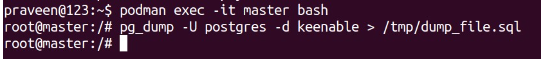

>DUMP file restore 


### 7. Create another table and explain about the different joins.

**Different types of joins:**


- Inner join: Returns all rows from both tables where the join condition is met.

>CREATE TABLE best_android_phones


>INSERT INTO best_android_phones 


>\dt

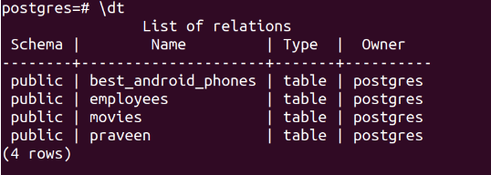

>select * from best_android_phones;


>CREATE TABLE ratings

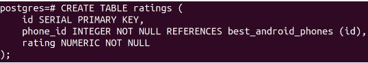

>INSERT INTO ratings

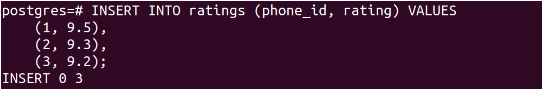

>INNER JOIN 

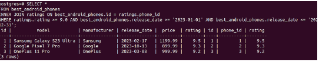